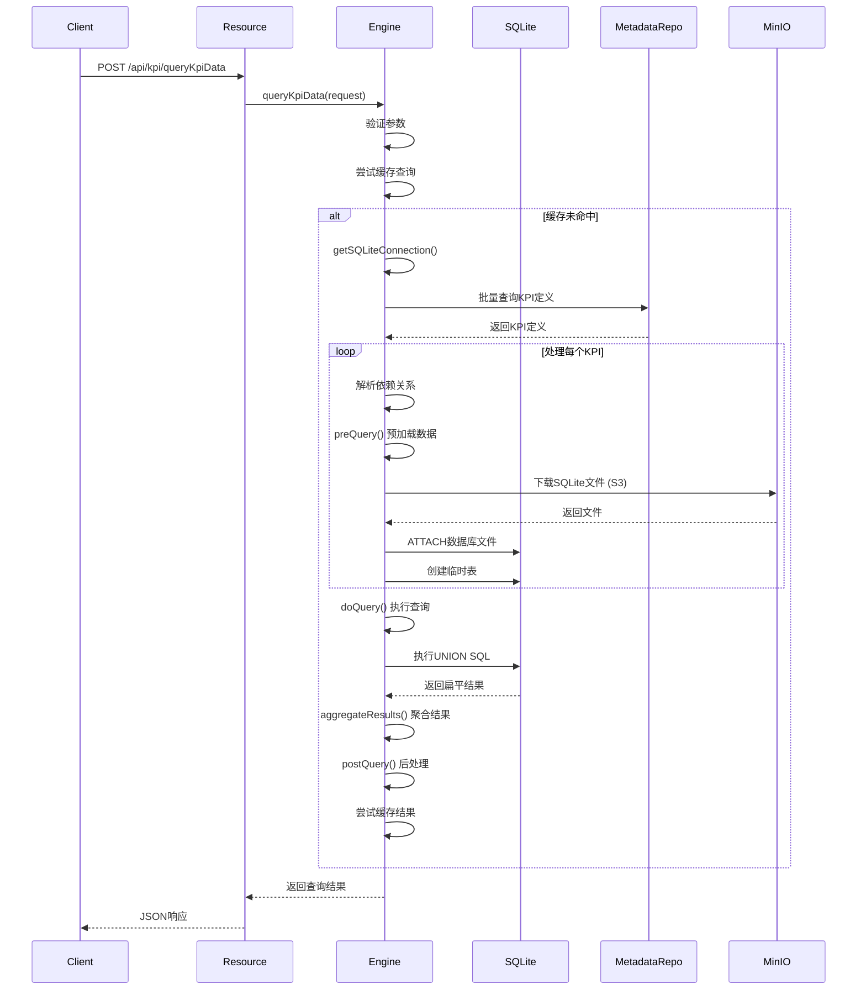

# DataOS Metrics Runtime - 新人指南

## 📋 项目概述

**DataOS Metrics Runtime** 是一个基于 **Quarkus 3.27 + JDK 21 虚拟线程** 的高性能KPI（关键绩效指标）查询引擎。核心能力是查询指标数据，支持多种指标类型（派生指标、复合指标、虚拟指标），使用 **SQLite** 作为主要查询引擎，**MySQL** 作为元数据存储。

### 核心特性

- ⚡ **高性能**：基于虚拟线程，每个请求独立线程处理
- 🔄 **多引擎支持**：支持SQLite内存查询、RDB查询等多种引擎
- 📊 **复杂指标支持**：支持派生指标、复合指标、虚拟指标
- 💾 **分层存储**：数据存储在S3（MinIO），元数据存储在MySQL
- 🎯 **聚合函数**：支持可加（sum）、半可加（first_value/last_value）、不可加（min/max）指标
- 🔍 **历史数据**：自动查询同比（lastYear）、环比（lastCycle）数据
- 🎯 **目标值**：支持目标值对比和校验结果

---

## 🏗️ 工程架构

### 整体架构图

```
┌─────────────────────────────────────────────────────────┐
│                    REST API Layer                        │
│              KpiQueryResource (/api/kpi)                │
└─────────────────────┬───────────────────────────────────┘
                      │
┌─────────────────────▼───────────────────────────────────┐
│              Query Engine Layer                          │
│  ┌───────────────┐  ┌──────────────┐  ┌──────────────┐  │
│  │   Factory     │  │   Abstract   │  │  SQLite      │  │
│  │   (Factory)   │─▶│   Engine     │◀─│  Engine      │  │
│  └───────────────┘  │  (Template)  │  │  (Impl)      │  │
│                     └──────────────┘  └──────────────┘  │
└─────────────────────┬───────────────────────────────────┘
                      │
┌─────────────────────▼───────────────────────────────────┐
│              Data Access Layer                           │
│  ┌───────────────┐  ┌──────────────┐  ┌──────────────┐  │
│  │   Metadata    │  │ SQLite File  │  │   MinIO      │  │
│  │ Repository    │  │   Manager    │  │   Service    │  │
│  │   (MySQL)     │  │              │  │   (S3 API)   │  │
│  └───────────────┘  └──────────────┘  └──────────────┘  │
└─────────────────────┬───────────────────────────────────┘
                      │
┌─────────────────────▼───────────────────────────────────┐
│                Storage Layer                             │
│  ┌───────────────┐  ┌──────────────┐  ┌──────────────┐  │
│  │    MySQL      │  │    SQLite    │  │   MinIO/S3   │  │
│  │   (MetaDB)    │  │  (In-Memory) │  │   (Data Files)│  │
│  └───────────────┘  └──────────────┘  └──────────────┘  │
└─────────────────────────────────────────────────────────┘
```

---

## 🎯 核心概念

### 1. KPI指标类型

#### 派生指标 (Extended KPI)
- **定义**：直接从底层数据表聚合计算的指标
- **示例**：KD1001 = sum(订单金额)
- **特点**：
  - `kpiType = "EXTENDED"`
  - `computeMethod = "normal"`
  - 使用聚合函数 (`aggFunc`) 进行计算
  - 支持三种聚合方式：
    - **可加**：`sum` - 可以按维度求和
    - **半可加**：`first_value/last_value` - 只能按部分维度聚合
    - **不可加**：`min/max/last_value/first_value` - 不能跨维度聚合

#### 复合指标 (Composite KPI)
分为两种子类型：

**a) 累计指标 (Cumulative)**
- **定义**：从期初累加到当前时间点的指标
- **示例**：月累计销售额 = sum(1月销售额) + sum(2月销售额) + ... + sum(当前月销售额)
- **特点**：
  - `kpiType = "COMPOSITE"`
  - `computeMethod = "cumulative"`
  - `kpiExpr` 指向被累计的基础指标

**b) 计算指标 (Expression)**
- **定义**：基于其他指标进行四则运算的指标
- **示例**：KD1003 = KD1001 / (KD1001 + KD1002)
- **特点**：
  - `kpiType = "COMPOSITE"`
  - `computeMethod = "expr"`
  - `kpiExpr` 包含四则运算表达式
  - 递归解析依赖的派生指标

#### 虚拟指标 (Virtual KPI)
- **定义**：用户动态传入的表达式，未在元数据库中定义的指标
- **示例**：`${KD1002}/(${KD1003}+${KD1005})`
- **特点**：
  - 不需要元数据定义
  - 表达式格式：`${KPI_ID[.timeModifier]}`
  - 时间修饰符：`current`、`lastCycle`、`lastYear`
  - 示例：`${KD1002.lastYear}` 表示去年同期的KD1002值

### 2. 维度体系

#### 原子维度 (DimDef)
- **定义**：不可再分的最小维度单元
- **示例**：城市ID (city_id)、区县ID (county_id)、渠道ID (channel_id)

#### 组合维度 (CompDimDef)
- **定义**：由多个原子维度组成的维度组合
- **示例**：CD003 = [city_id, county_id, channel_id]

#### 维度表命名规则
- **维度数据表**：`kpi_dim_{compDimCode}`（如：`kpi_dim_CD003`）
- **目标值表**：`kpi_target_value_{compDimCode}`（如：`kpi_target_value_CD003`）

### 3. 数据表命名规则

#### SQLite数据表
- **命名格式**：`{kpi_id}_{op_time}_{compDimCode}`
- **示例**：`KD1002_20251104_CD003`
- **表结构**：
  ```sql
  CREATE TABLE KD1002_20251104_CD003 (
      kpi_id TEXT,
      op_time TEXT,
      city_id TEXT,
      county_id TEXT,
      channel_id TEXT,
      kpi_val TEXT,
      PRIMARY KEY (kpi_id, op_time, city_id, county_id, channel_id)
  )
  ```

#### S3文件路径
- **格式**：`{YYYY}/{YYYYMM}/{YYYYMMDD}/{compDimCode}/{kpi_id}_{op_time}_{compDimCode}.db.gz`
- **示例**：`2025/202511/20251104/CD003/KD1002_20251104_CD003.db.gz`

---

## 📁 核心代码结构

### 主要目录结构

```
src/
├── main/
│   ├── java/com/asiainfo/metrics/
│   │   ├── Application.java                          # 启动类
│   │   ├── config/                                   # 配置类
│   │   │   ├── MetricsConfig.java                    # 指标配置
│   │   │   └── SQLiteConfig.java                     # SQLite配置
│   │   ├── model/                                    # 数据模型
│   │   │   ├── db/                                   # 数据库模型
│   │   │   │   ├── KpiDefinition.java                # KPI定义
│   │   │   │   ├── DimDef.java                       # 原子维度
│   │   │   │   ├── CompDimDef.java                   # 组合维度
│   │   │   │   └── KpiModel.java                     # 指标模型
│   │   │   ├── http/                                 # HTTP模型
│   │   │   │   ├── KpiQueryRequest.java              # 查询请求
│   │   │   │   └── KpiQueryResult.java               # 查询结果
│   │   │   └── KpiRowMaper.java                      # 结果映射
│   │   ├── resource/                                 # REST资源
│   │   │   └── KpiQueryResource.java                 # 查询API
│   │   ├── service/                                  # 业务服务
│   │   │   ├── AbstractKpiQueryEngine.java           # 抽象引擎基类
│   │   │   ├── AbstractKpiQueryEngineImpl.java       # 通用实现
│   │   │   ├── KpiSQLiteEngine.java                  # SQLite引擎
│   │   │   ├── KpiResultAggregator.java              # 结果聚合
│   │   │   ├── SQLiteFileManager.java                # 文件管理
│   │   │   ├── KpiComputeService.java                # 计算服务
│   │   │   └── KpiQueryEngine.java                   # 引擎接口
│   │   └── repository/                               # 数据访问
│   │       └── KpiMetadataRepository.java            # 元数据仓库
│   └── resources/
│       └── application.yml                            # 配置文件
└── test/                                             # 测试代码
```

### 核心类说明

#### 1. KpiQueryResource.java
- **作用**：REST API入口
- **路径**：`/api/kpi/queryKpiData`
- **方法**：POST
- **功能**：接收KPI查询请求，调用查询引擎，返回结果

#### 2. AbstractKpiQueryEngine.java
- **作用**：抽象基类，定义查询流程
- **设计模式**：模板方法 (Template Method)
- **核心流程**：
  1. 参数验证
  2. 缓存查询
  3. 预查询（加载数据）
  4. 执行查询
  5. 结果聚合
  6. 后处理
  7. 缓存结果

#### 3. AbstractKpiQueryEngineImpl.java
- **作用**：通用实现逻辑
- **核心功能**：
  - KPI依赖解析
  - 表达式转换
  - 结果聚合
  - 聚合函数处理

#### 4. KpiSQLiteEngine.java
- **作用**：SQLite引擎实现
- **核心特性**：
  - 每KPI每时间点独立表
  - UNION ALL查询模式
  - 虚拟指标支持
  - 历史数据自动加载

#### 5. KpiMetadataRepository.java
- **作用**：访问MySQL元数据库
- **核心功能**：
  - 批量查询KPI定义
  - 提取KPI引用
  - 获取维度定义
  - 解析组合维度

#### 6. SQLiteFileManager.java
- **作用**：管理SQLite文件
- **核心功能**：
  - 从MinIO下载SQLite文件
  - 本地缓存和压缩
  - 表结构创建
  - 数据插入

---

## 🔍 核心流程解析

### KPI查询完整流程



### 虚拟指标处理流程

```mermaid
flowchart TD
    A[解析表达式 ${KD1002}/(${KD1003}+${KD1005})] --> B[提取KPI引用]
    B --> C[获取依赖KPI定义]
    C --> D[构建依赖KPI查询]
    D --> E[UNION ALL所有依赖KPI]
    E --> F[外层计算表达式]
    F --> G[返回结果]
```

---

## 🔧 关键实现细节

### 1. 聚合函数处理

根据指标的可加性，KPI定义中指定 `aggFunc` 字段：

```java
protected String buildAggExpression(String aggFunc, String field, String opTime) {
    String timeFilterExpr = "case when t.op_time = '" + opTime + "' then " + field + " else null end";

    switch (aggFunc.toLowerCase()) {
        case "sum":
            // 可加：直接求和
            return "sum(" + timeFilterExpr + ")";
        case "first_value":
            // 半可加：取第一个值
            return "first_value(" + timeFilterExpr + ") over (partition by t.kpi_id order by t.op_time)";
        case "last_value":
            // 半可加：取最后一个值
            return "last_value(" + timeFilterExpr + ") over (partition by t.kpi_id order by t.op_time)";
        case "min":
            // 不可加：取最小值
            return "min(" + timeFilterExpr + ")";
        case "max":
            // 不可加：取最大值
            return "max(" + timeFilterExpr + ")";
        default:
            return "sum(" + timeFilterExpr + ")";
    }
}
```

### 2. 表达式转换为SQL

虚拟指标表达式转换示例：

**输入**：`${KD1002}/(${KD1003}+${KD1005})`

**转换过程**：
1. 提取KPI引用：KD1002, KD1003, KD1005
2. 转换为聚合表达式：
   ```sql
   sum(case when t.kpi_id = 'KD1002' and t.op_time = '20251104' then t.kpi_val else null end) /
   (sum(case when t.kpi_id = 'KD1003' and t.op_time = '20251104' then t.kpi_val else null end) +
    sum(case when t.kpi_id = 'KD1005' and t.op_time = '20251104' then t.kpi_val else null end))
   ```

### 3. SQLite查询构建

SQLite引擎采用**每KPI每时间点独立表**的设计，查询时使用UNION ALL：

```sql
-- KD1002当前时间点
SELECT city_id, county_id, 'KD1002' as kpi_id, '20251104' as op_time,
       sum(kpi_val) as current
FROM KD1002_20251104_CD003
WHERE 1=1 AND city_id IN ('4','10')
GROUP BY city_id, county_id

UNION ALL

-- KD1002上期
SELECT city_id, county_id, 'KD1002' as kpi_id, '20241004' as op_time,
       sum(kpi_val) as current
FROM KD1002_20241004_CD003
WHERE 1=1 AND city_id IN ('4','10')
GROUP BY city_id, county_id

UNION ALL

-- KD1002去年同期
SELECT city_id, county_id, 'KD1002' as kpi_id, '20231104' as op_time,
       sum(kpi_val) as current
FROM KD1002_20231104_CD003
WHERE 1=1 AND city_id IN ('4','10')
GROUP BY city_id, county_id
```

### 4. 历史数据计算

根据时间周期类型，自动计算历史时间点：

```java
// 计算上一周期时间（月）
protected String calculateLastCycleTime(String currentOpTime) {
    LocalDate current = LocalDate.parse(currentOpTime, DateTimeFormatter.ofPattern("yyyyMMdd"));
    LocalDate lastCycle = current.minusMonths(1);
    return lastCycle.format(DateTimeFormatter.ofPattern("yyyyMMdd"));
}

// 计算去年同期时间（年）
protected String calculateLastYearTime(String currentOpTime) {
    LocalDate current = LocalDate.parse(currentOpTime, DateTimeFormatter.ofPattern("yyyyMMdd"));
    LocalDate lastYear = current.minusYears(1);
    return lastYear.format(DateTimeFormatter.ofPattern("yyyyMMdd"));
}
```

### 5. 结果聚合

将扁平化结果按维度聚合：

```java
// 按维度+时间分组
Map<String, Map<String, Object>> aggregatedMap = new LinkedHashMap<>();

for (Map<String, Object> row : flatResults) {
    String groupKey = buildGroupKey(row, dimFields);

    Map<String, Object> aggregatedRow = aggregatedMap.computeIfAbsent(groupKey, key -> {
        // 初始化新行，复制维度字段
        Map<String, Object> newRow = new LinkedHashMap<>();
        copyDimFields(newRow, row, dimFields);
        newRow.put("kpiValues", new LinkedHashMap<String, Map<String, Object>>());
        return newRow;
    });

    // 构建KPI值对象
    String kpiId = (String) row.get("kpi_id");
    Map<String, Object> kpiValueMap = buildKpiValueMap(row);
    aggregatedRow.get("kpiValues").put(kpiId, kpiValueMap);
}
```

---

## 💾 数据存储设计

### 元数据库 (MySQL)

#### metrics_def 表（指标定义）
```sql
CREATE TABLE metrics_def (
    kpi_id VARCHAR(32) PRIMARY KEY,         -- KPI编码 (KD1001)
    kpi_name VARCHAR(128),                   -- KPI名称
    kpi_type VARCHAR(32),                    -- 指标类型 (EXTENDED, COMPOSITE, EXPRESSION)
    comp_dim_code VARCHAR(32),               -- 组合维度编码 (CD003)
    cycle_type VARCHAR(32),                  -- 周期类型 (DAY, MONTH, YEAR)
    topic_id VARCHAR(64),                    -- 主题ID
    team_name VARCHAR(64),                   -- 团队名称
    kpi_expr TEXT,                           -- 指标表达式
    compute_method VARCHAR(32),              -- 计算方法 (normal, expr, cumulative)
    agg_func VARCHAR(32),                    -- 聚合函数 (sum, min, max, first_value, last_value)
    create_time DATETIME,
    update_time DATETIME
);
```

#### metrics_dim_def 表（原子维度）
```sql
CREATE TABLE metrics_dim_def (
    dim_code VARCHAR(32) PRIMARY KEY,        -- 维度编码 (D1001)
    dim_name VARCHAR(128),                   -- 维度名称
    dim_type VARCHAR(32),                    -- 维度类型
    dim_val_type VARCHAR(32),                -- 维度值类型
    dim_val_conf VARCHAR(512),               -- 维度值配置
    dim_desc VARCHAR(512),                   -- 维度描述
    db_col_name VARCHAR(64),                 -- 数据库列名 (city_id)
    t_state VARCHAR(32),                     -- 状态
    create_time DATETIME,
    update_time DATETIME
);
```

#### metrics_comp_dim_def 表（组合维度）
```sql
CREATE TABLE metrics_comp_dim_def (
    comp_dim_code VARCHAR(32) PRIMARY KEY,   -- 组合维度编码 (CD003)
    comp_dim_name VARCHAR(128),              -- 组合维度名称
    comp_dim_conf TEXT,                      -- 组合维度配置 (JSON数组)
    t_state VARCHAR(32),                     -- 状态
    team_name VARCHAR(64),                   -- 团队名称
    create_time DATETIME,
    update_time DATETIME
);
```

**comp_dim_conf 示例**：
```json
[
  {"dimCode": "D1001", "dimName": "城市", "dbColName": "city_id"},
  {"dimCode": "D1002", "dimName": "区县", "dbColName": "county_id"},
  {"dimCode": "D1003", "dimName": "渠道", "dbColName": "channel_id"}
]
```

#### metrics_model_def 表（指标模型）
```sql
CREATE TABLE metrics_model_def (
    model_id VARCHAR(32) PRIMARY KEY,        -- 模型ID
    model_name VARCHAR(128),                 -- 模型名称
    model_type VARCHAR(32),                  -- 模型类型
    comp_dim_code VARCHAR(32),               -- 组合维度编码
    model_ds_name VARCHAR(128),              -- 数据源名称
    model_sql TEXT,                          -- 取数SQL
    t_state VARCHAR(32),                     -- 状态
    team_name VARCHAR(64),                   -- 团队名称
    create_time DATETIME,
    update_time DATETIME
);
```

### 数据文件 (MinIO/S3)

#### 目录结构
```
sqlite-files/
├── dim/                                    # 维度表
│   └── kpi_dim_CD003.db.gz
├── target/                                 # 目标值表
│   └── kpi_target_value_CD003.db.gz
└── 2025/                                  # 按年分目录
    ├── 202511/                            # 按月分目录
    │   ├── 20251104/                      # 按日分目录
    │   │   ├── CD003/                     # 组合维度目录
    │   │   │   ├── KD1001_20251104_CD003.db.gz
    │   │   │   ├── KD1002_20251104_CD003.db.gz
    │   │   │   └── KD1003_20251104_CD003.db.gz
    │   │   └── CD004/
    │   │       └── ...
    │   └── 20251103/
    │       └── ...
    └── 202510/
        └── ...
```

#### SQLite表结构
```sql
-- KPI数据表
CREATE TABLE KD1002_20251104_CD003 (
    kpi_id TEXT NOT NULL,
    op_time TEXT NOT NULL,
    city_id TEXT,
    county_id TEXT,
    channel_id TEXT,
    kpi_val TEXT,
    PRIMARY KEY (kpi_id, op_time, city_id, county_id, channel_id)
);

-- 维度表
CREATE TABLE kpi_dim_CD003 (
    dim_code TEXT PRIMARY KEY,
    dim_val TEXT,
    dim_id TEXT,
    parent_dim_code TEXT
);

-- 目标值表
CREATE TABLE kpi_target_value_CD003 (
    op_time TEXT,
    kpi_id TEXT,
    city_id TEXT,
    county TEXT,
    channel_id TEXT,
    target_value TEXT,
    check_result TEXT,
    check_desc TEXT,
    eff_start_date DATETIME,
    eff_end_date DATETIME,
    PRIMARY KEY (op_time, kpi_id, city_id, county, channel_id)
);
```

---

## 🚀 快速上手

### 环境要求

- **JDK**: 21+ (使用虚拟线程)
- **构建工具**: Gradle 8.10+
- **Quarkus**: 3.27.0
- **数据库**: MySQL 8.0+ (元数据)、SQLite 3.45+ (查询引擎)
- **存储**: MinIO或S3兼容存储

### 配置开发环境

1. **安装JDK 21**
   ```bash
   # 使用sdkman (推荐)
   curl -s "https://get.sdkman.io" | bash
   sdk install java 21.0.9-tem
   sdk use java 21.0.9-tem

   # 或直接从Oracle下载安装
   # https://www.oracle.com/java/technologies/downloads/#java21
   ```

2. **安装Gradle**
   ```bash
   sdk install gradle 8.10.2
   ```

3. **配置环境变量**
   ```bash
   # ~/.zshrc
   export JAVA_HOME=$(/usr/libexec/java_home -v 21)
   export PATH=$JAVA_HOME/bin:$PATH
   ```

### 项目配置

修改 `src/main/resources/application.yml`：

```yaml
# Quarkus配置
quarkus:
  datasource:
    metadb:                             # MySQL元数据库
      jdbc.url: jdbc:mysql://localhost:3306/dataos_metrics
      jdbc.driver: com.mysql.cj.jdbc.Driver
      username: ${DB_USERNAME:root}
      password: ${DB_PASSWORD:password}
    sqlite:                             # SQLite内存数据库
      jdbc.url: jdbc:sqlite:file:memdb?mode=memory
      jdbc.driver: org.sqlite.JDBC

  # Redis缓存
  redis:
    hosts: localhost:6379
    password: ${REDIS_PASSWORD:}

# 指标配置
metrics:
  engine:
    type: SQLite                         # 引擎类型: SQLite/RDB
  sqlite:
    storage.dir: /data/sqlite-storage    # SQLite文件存储目录
  cache:
    ttl.minutes: 60                      # 缓存TTL (分钟)

# MinIO配置
minio:
  endpoint: http://localhost:9000
  access-key: ${MINIO_ACCESS_KEY:minioadmin}
  secret-key: ${MINIO_SECRET_KEY:minioadmin}
  bucket: metrics-runtime
```

### 启动项目

```bash
# 1. 克隆项目
git clone <project-repo>
cd dataos-metrics-runtime

# 2. 编译项目
./gradlew clean build

# 3. 启动开发模式 (Quarkus Dev Mode)
./gradlew quarkusDev

# 或直接运行
java -jar build/quarkus-app/quarkus-run.jar
```

### 测试API

```bash
# 查询KPI定义
curl -X GET "http://localhost:8080/api/kpi/queryKpiDef?kpiId=KD1001"

# 查询KPI数据
curl -X POST "http://localhost:8080/api/kpi/queryKpiData" \
  -H "Content-Type: application/json" \
  -d '{
    "kpiArray": ["KD1001", "KD1002"],
    "opTimeArray": ["20251104"],
    "dimCodeArray": ["city_id", "county_id"],
    "dimConditionArray": [
      {"dimConditionCode": "city_id", "dimConditionVal": "4,10"}
    ],
    "includeHistoricalData": true,
    "includeTargetData": false
  }'
```

---

## 📊 使用示例

### 示例1：查询派生指标

```json
{
  "kpiArray": ["KD1001"],
  "opTimeArray": ["20251104"],
  "dimCodeArray": ["city_id", "county_id"],
  "dimConditionArray": [
    {"dimConditionCode": "city_id", "dimConditionVal": "4,10"}
  ],
  "includeHistoricalData": true,
  "includeTargetData": false
}
```

**响应**：
```json
{
  "dataArray": [
    {
      "city_id": "4",
      "city_id_desc": "北京市",
      "county_id": "100",
      "county_id_desc": "朝阳区",
      "opTime": "20251104",
      "kpiValues": {
        "KD1001": {
          "current": "1000",
          "lastYear": "900",
          "lastCycle": "950"
        }
      }
    }
  ],
  "status": "0000",
  "msg": "查询成功！耗时 123 ms"
}
```

### 示例2：查询复合指标（计算指标）

```json
{
  "kpiArray": ["KD1003"],
  "opTimeArray": ["20251104"],
  "dimCodeArray": ["city_id"],
  "includeHistoricalData": true,
  "includeTargetData": false
}
```

**KD1003定义**：
```json
{
  "kpiId": "KD1003",
  "kpiName": "转化率",
  "kpiType": "COMPOSITE",
  "computeMethod": "expr",
  "kpiExpr": "KD1001 / (KD1001 + KD1002)",
  "aggFunc": "sum"
}
```

**查询逻辑**：
1. 解析表达式：`KD1001 / (KD1001 + KD1002)`
2. 找到依赖指标：KD1001, KD1002
3. 构建SQL：
   ```sql
   SELECT
     city_id,
     sum(CASE WHEN kpi_id = 'KD1001' THEN kpi_val ELSE NULL END) as kd1001_sum,
     sum(CASE WHEN kpi_id = 'KD1002' THEN kpi_val ELSE NULL END) as kd1002_sum,
     -- 计算转化率
     kd1001_sum / (kd1001_sum + kd1002_sum) as current
   FROM ...
   GROUP BY city_id
   ```

### 示例3：查询虚拟指标

```json
{
  "kpiArray": ["${KD1002}/(${KD1003}+${KD1005})"],
  "opTimeArray": ["20251104"],
  "dimCodeArray": ["city_id"],
  "includeHistoricalData": true,
  "includeTargetData": false
}
```

**查询逻辑**：
1. 解析表达式：`${KD1002}/(${KD1003}+${KD1005})`
2. 提取KPI引用：KD1002, KD1003, KD1005
3. 构建虚拟指标查询：
   ```sql
   SELECT
     city_id,
     SUM(CASE WHEN kpi_id = 'KD1002' THEN kpi_val ELSE NULL END) /
     (SUM(CASE WHEN kpi_id = 'KD1003' THEN kpi_val ELSE NULL END) +
      SUM(CASE WHEN kpi_id = 'KD1005' THEN kpi_val ELSE NULL END)) as current
   FROM (
     -- UNION ALL KD1002, KD1003, KD1005的数据
   ) t
   GROUP BY city_id
   ```

### 示例4：查询累计指标

```json
{
  "kpiArray": ["KD2001"],
  "opTimeArray": ["20251104"],
  "dimCodeArray": ["city_id"],
  "includeHistoricalData": false,
  "includeTargetData": false
}
```

**KD2001定义**：
```json
{
  "kpiId": "KD2001",
  "kpiName": "月累计销售额",
  "kpiType": "COMPOSITE",
  "computeMethod": "cumulative",
  "kpiExpr": "KD1001",
  "aggFunc": "sum"
}
```

**查询逻辑**：
1. 解析累计逻辑：从月初1号累加到当前时间
2. 计算日期范围：`20251101` 到 `20251104`
3. 构建SQL：
   ```sql
   SELECT city_id, SUM(kpi_val) as current
   FROM (
     SELECT * FROM KD1001_20251101_CD003
     UNION ALL
     SELECT * FROM KD1001_20251102_CD003
     UNION ALL
     SELECT * FROM KD1001_20251103_CD003
     UNION ALL
     SELECT * FROM KD1001_20251104_CD003
   ) t
   GROUP BY city_id
   ```

---

## 🛠️ 扩展开发指南

### 添加新的查询引擎

1. **创建引擎类**
   ```java
   @ApplicationScoped
   public class MyCustomEngine extends AbstractKpiQueryEngineImpl {
       @Override
       protected Connection getSQLiteConnection(KpiQueryRequest request) {
           // 返回数据库连接
       }

       @Override
       protected String getKpiDataTableName(String kpiId, String cycleType, String compDimCode, String opTime) {
           // 返回表名
       }

       @Override
       protected String getDimDataTableName(String compDimCode) {
           // 返回维度表名
       }

       @Override
       protected List<Map<String, Object>> doQuery(KpiQueryRequest request, Connection conn) throws Exception {
           // 实现查询逻辑
       }
   }
   ```

2. **配置引擎**
   ```java
   @ApplicationScoped
   public class KpiQueryEngineFactory {
       private final KpiQueryEngine sqliteEngine;
       private final KpiQueryEngine rdbEngine;

       @Inject
       public KpiQueryEngineFactory(KpiSQLiteEngine sqliteEngine, KpiRdbEngine rdbEngine) {
           this.sqliteEngine = sqliteEngine;
           this.rdbEngine = rdbEngine;
       }

       public KpiQueryEngine getQueryEngine() {
           String engineType = ConfigProvider.getConfig()
               .getValue("metrics.engine.type", String.class);
           return "SQLite".equalsIgnoreCase(engineType) ? sqliteEngine : rdbEngine;
       }

       public String getEngineDescription() {
           String engineType = ConfigProvider.getConfig()
               .getValue("metrics.engine.type", String.class);
           return "DataOS Metrics Runtime - " + engineType + " Engine";
       }
   }
   ```

### 添加新的聚合函数

1. **扩展聚合函数枚举**
   ```java
   public enum AggFunc {
       SUM("sum"),
       AVG("avg"),
       MEDIAN("median");  // 添加中位数聚合

       private final String sqlFunc;

       AggFunc(String sqlFunc) {
           this.sqlFunc = sqlFunc;
       }

       public String getSqlFunc() {
           return sqlFunc;
       }
   }
   ```

2. **更新聚合表达式构建**
   ```java
   protected String buildAggExpression(String aggFunc, String field, String opTime) {
       // ... 现有代码 ...

       case "avg":
           // 平均值
           return "avg(" + timeFilterExpr + ")";

       case "median":
           // 中位数 - 需要自定义实现
           return "PERCENTILE_CONT(0.5) WITHIN GROUP (ORDER BY " + timeFilterExpr + ")";

       // ...
   }
   ```

### 自定义结果聚合

```java
@Component
public class CustomResultAggregator extends KpiResultAggregator {

    /**
     * 自定义聚合逻辑
     */
    public static List<Map<String, Object>> aggregateWithPercentile(
            List<Map<String, Object>> flatResults,
            KpiQueryRequest request) {
        // 实现自定义聚合
    }
}
```

---

## ⚠️ 注意事项

### 1. KPI定义规范

- **KPI ID**：必须以 `K` 开头，后跟类型字母（D-派生，C-复合，Y-累计，M-月），再跟4位数字
  - 正确：`KD1001`, `KC2001`, `KY3001`, `KM4001`
  - 错误：`K1001`, `KD01`, `XK1001`

- **聚合函数**：根据指标类型选择
  - 可加指标：使用 `sum`
  - 半可加指标：使用 `first_value/last_value`
  - 不可加指标：使用 `min/max`

- **表达式格式**：
  - 派生指标：SQL片段或简单的KPI引用
  - 复合指标：四则运算表达式，使用KPI ID
  - 虚拟指标：`${KPI_ID[.timeModifier]}` 格式

### 2. 性能优化

- **批量查询**：避免循环中查询数据库，使用批量查询API
- **索引优化**：确保MySQL元数据库的索引合理
  ```sql
  -- 关键索引
  CREATE INDEX idx_metrics_def_kpi_type ON metrics_def(kpi_type);
  CREATE INDEX idx_metrics_def_compute_method ON metrics_def(compute_method);
  ```

- **缓存策略**：合理设置Redis缓存TTL，默认60分钟

- **SQL优化**：
  - SQLite查询使用UNION ALL，避免复杂JOIN
  - 优先使用简单聚合函数（sum/min/max），窗口函数性能较差
  - 维度字段数量不宜过多，建议不超过5个

### 3. 错误处理

- **数据缺失**：当S3文件不存在时，创建空表保证SQL正常执行
- **异常捕获**：统一在`queryKpiData`方法中处理异常
- **日志记录**：关键步骤添加DEBUG级别日志，便于问题定位

```java
try {
    addDataTable(conn, opTime, kpiId, compDimCode);
} catch (RuntimeException e) {
    if(e.getMessage()!=null && e.getMessage().contains(SQLiteFileManager.S3_FILE_NOT_EXISTS)) {
        // 创建空表保证SQL正常执行
        createEmptyDataTable(conn, opTime, kpiId, compDimCode);
    } else {
        throw e;
    }
}
```

### 4. 虚拟线程注意事项

- **阻塞操作**：虚拟线程适合IO密集型任务，避免CPU密集型计算
- **线程池**：不要手动创建线程池，使用`Executors.newVirtualThreadPerTaskExecutor()`
- **阻塞库**：确保使用的库支持虚拟线程（JDBC 4.3+，HTTP客户端等）

```java
@GET
@Path("/query")
@RunOnVirtualThread  // 标记在虚拟线程中执行
public Response queryKpiData(KpiQueryRequest request) {
    // 这里会在虚拟线程中执行
    // 阻塞操作（如数据库查询）不会阻塞操作系统线程
}
```

### 5. 数据一致性

- **幂等性**：使用`INSERT OR REPLACE`保证数据插入幂等性
- **主键约束**：SQLite表必须定义复合主键保证数据唯一
- **事务控制**：批量操作时使用事务

```java
try (PreparedStatement pstmt = conn.prepareStatement(insertSql)) {
    conn.setAutoCommit(false);  // 开启事务
    // 批量插入
    pstmt.executeBatch();
    conn.commit();  // 提交事务
}
```

---

## 🐛 常见问题

### Q1: 虚拟指标表达式解析失败

**现象**：
```
ERROR: 提取KPI引用失败，表达式: ${KD1002}.lastCycle
```

**原因**：
- 表达式中使用了未定义的时间修饰符
- 或使用了错误的KPI ID格式

**解决**：
- 检查表达式格式：`${KPI_ID[.timeModifier]}`
- 支持的修饰符：`current`、`lastCycle`、`lastYear`
- KPI ID格式：以K开头，后跟1位类型字母（D/C/Y/M），再跟4位数字

### Q2: SQLite表不存在错误

**现象**：
```
ERROR: no such table: KD1002_20251104_CD003
```

**原因**：
- MinIO中不存在对应的SQLite文件
- 文件路径配置错误

**解决**：
- 检查S3文件是否存在：`2025/202511/20251104/CD003/KD1002_20251104_CD003.db.gz`
- 确认MinIO配置正确
- 确认`metrics.sqlite.storage.dir`配置正确

### Q3: 聚合结果不准确

**现象**：
- 不同维度的聚合结果不同
- 同比环比数据异常

**原因**：
- 聚合函数选择错误（使用了不可加指标）
- 时间点计算错误

**解决**：
- 检查KPI定义的`aggFunc`字段
- 确认`cycleType`和`computeMethod`配置正确
- 检查时间点计算逻辑

### Q4: 内存占用过高

**现象**：
- 查询大时间范围时内存溢出
- 虚拟指标依赖过多导致内存不足

**原因**：
- 一次查询加载了过多KPI数据
- 没有设置合理的查询限制

**解决**：
- 限制单次查询的KPI数量（建议不超过10个）
- 限制时间范围（建议不超过30天）
- 考虑分页查询

---

## 📚 参考资料

- [Quarkus 3.27 官方文档](https://quarkus.io/version/3.27/)
- [JDK 21 虚拟线程指南](https://docs.oracle.com/en/java/javase/21/core/virtual-threads.html)
- [SQLite JDBC 驱动](https://github.com/xerial/sqlite-jdbc)
- [Quarkus RESTEasy](https://quarkus.io/guides/rest-json)
- [Quarkus Agroal (数据库连接池)](https://quarkus.io/guides/datasource)
- [MinIO Java SDK](https://min.io/docs/minio/java/server-sdk-java.html)

---
